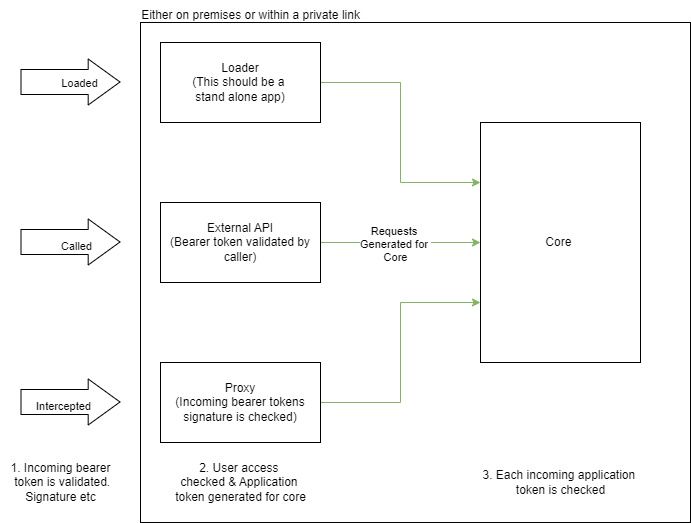

# Authentication
So we will have varying levels of authentication, as from the proxy we will need to intercept a request to see if a user has sufficent privileges to detokenize or tokenize. The next section is when we get the request from the proxy or other service to the core API.

## Proxy Authentication
This is a bit more interesting, because I just need to validate what ever token is being sent. Different applications will have different auth methods so this will likely need to be tailored to the request. Either way its an ID style token. 

All this service needs to figure out authentication wise is if the token can be detokenized or not. If not just dont even call the core service. We will need a way to track context

Actually after revising this, we should validate this bearer and its signature, lets not even waste time on calls with invalid inputs. Also as a security measure I dont want people peering on tokens created.

## Core Authentication
Most of the time the requests coming here are requests from other internal services, none the less we will operate a zero trust policy and need AuthZ&AuthN, I need a token which identifies the application calling the core application and the access level. Effectively an access token.

Validate Access token:
Access token should contain role or privileges, then based on the roles transformation can occur. We need some field to track the contexts to identify which requests had come.

From the token, I need:
- Name of Application calling core service
- Client Id of application
- Configuration Version being used

From the context, I need:
- Operation to be performed (Transform or not)
- Method to track downstream calls (GUID to track calls for logs)

## External API
This is a bit more of an idea if I am too push the multi tenant stuff first. Likely an application access style token.

## Loader
TODO

## Overview of flow

