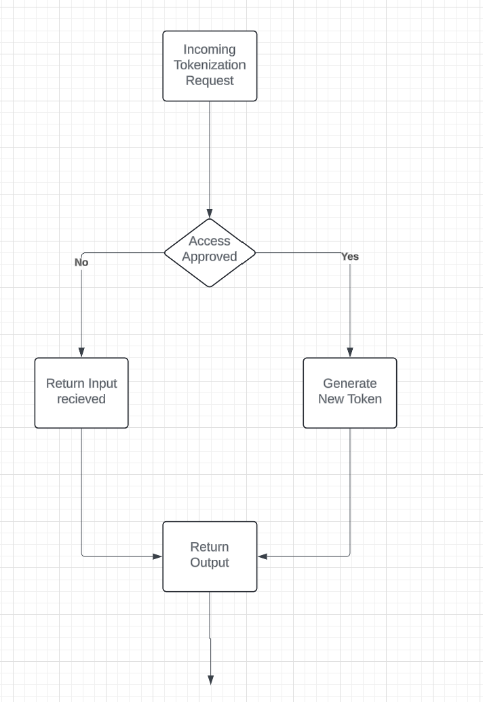

# Tokenization Flow
Here we will outline the process used to generate a token in the engine service. From when a clear value is recieved to how the tokenized value is returned. 

## Overview

A value is recieved to tokenize to be tokenized like "Dave" this is received on the engine API with a tokenization method to be used for example lets say method x. 

### Deterministic steps:
1. Value and Method recieved.
2. Check if token exists for value.
3(A). 
    - Fetch token which exists for value.
    - Return existing token value.
3(B).
    - Identified token does not exist for value.
    - Encrypt value and add to vault with next token value.
    - Return new token.

#### Note
- While the deterministic approach will have less tokens, it may take longer time to generate due to the check to identify if a token is preexisting. 
- This may also cause issue on simulatenous additions of the same value.

### Non Deterministic steps:
1. Value and Method recieved.
2. Genereate Token and value pair.
3. Add to the vault.
3. Return tokenized values

#### Note
- This is a much cleaner generation but the token size can grow exponentionally.
- It is important we have a purging method agreed, along with a process on when to purge.

