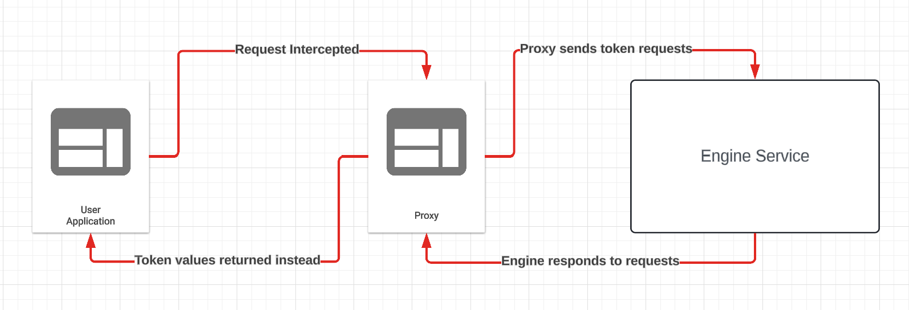
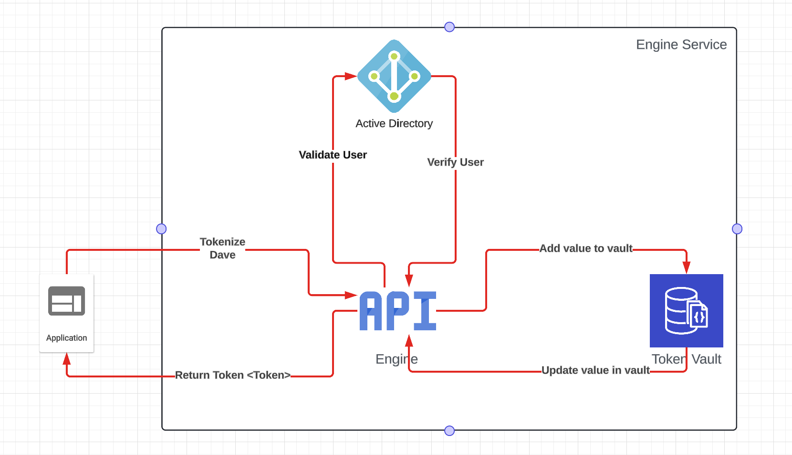
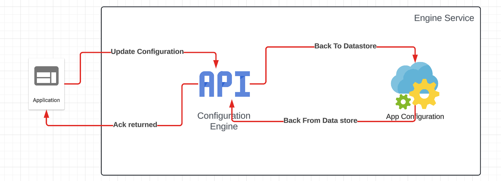

# Overview
The aim of this document is to give a general overview of how this system will work, various assumptions made and some details relating to the infrastructure.

## What is this?
The aim is to produce a system which allows a client to submit information to produce a string token which the client can then use in there applications. When required these tokens can also be detokenized to return the clear values. A configuration style API will also exists to allows tenants to configure the system for there very needs. For example a company may want to store all PII as tokens to prevent visibility in applications, as a result they would convert all values to tokens and use tokens solely in the application.

A reverse proxy will also be added as an example to show such a system could be implemented for existing API's

## Why do we need this?
As cyber security becomes more of a concern this systems aims to replace a systems sensitive data with non sensitive tokens. In cases of data leak or a breach non sensitive data will be stolen. This can also be beneficial when attempting to achieve various security certifications such as SOC. There transformation API's will also provide high levels of auditiability. Allowing administrators to track who is viewing what data to help identify unusual behaviour.

## How does it look
As the MVP version has as little services as possible this is what it will look like for a standard proxy based flow.

Basic proxy flow of request being sent from application to proxy, which then parses the request and identifies tokens which need to be created or detokenized. It then generates the values to be swapped before it swaps in the correct value.

Overview of how a request is handled once sent to the engine service. We validate the user before they can access the token store.

Configuration service will use engine service for setting configuration specific information

### Engine Service
The engine service for now will handle assigning configuration and processing tokens such as generation and detoknization. This will start as a monolith but allowances will be made for a seperation at a later time to remove configuration. This will be a dotnet application.

### Proxy Service
This service will sit in front of a customers API and basically catches the various information we need to tokenize and generate requests to the engine. Based on the response it will substitute the new token values into the response. It will also complete the inverse in cases where we are detokenizing.

## Where does all this stuff live?
So this is where it all gets a bit tricky, do we want to have a cluster per tenant or should we a multi tenanted application which handles requests for all tenants.

I mean for the engine you could have a multi tenanted application as there should be no bespoke implementations for different tenants. The proxy is completely out of the question. I believe this should follow a similar pattern as Azure AD where each tenant has an authentication server. Handling all tenants on one application could causes issue with data being leaked between tenants. Which is not an accpetable risk

#### Cluster Per Tenant
The main benefit of doing this is some tenants will want to run these application in there own infrastructure or using a private link as it will contain sensitive data. This allows us to greater control which version tenants run. But as we add more tenants this will be a nightmare to manage. 

#### Multi tenanted application:
This is the ideal scenario, one application to rule them all, ensure this application is hardened auth users route them to the correct data stores. But how would logging and telemetry look, auditing for this application would be tricky to manage and could be prone to logs leaking. 

## How does the tokenization work
So there is various ways to generate tokens there is two ideas right now which exist one is a token vault and another is a tokenless vault. This tokenless vault in theory sounds impressive. But this is pretty much encryption. For an MVP we will continue will a vaulted solution as we are generating tokens not encryption values (well we encrypt to but you only need a token)

### Vault solution
The idea here is that the token value will map to an encrypted value, so no values are stored in clear. How these values are tokenized will be defined in a tenants configurations.

### Vaultless solution
#TODO add informaiton

#TODO Delete inforomation below i need to find a better home for it

#### What happens with the same values
The same value will produce the same token, it does not mean tokens can be reversed engineered. We detect if a value has been tokenized before and if so we return the token previously generated. 

#### How do you know a token is no longer used?
Short answer is we wont. Right now there is no way of removing tokens or purging old values. We will have to keep track off all tokens. Yes this over time could lead to a very large data store but no values will be repeated.

## What do the various data stores look like
There will be two main data stores the first is for for storing tenant configuration:
- Different tokenization techniques.
- How the proxy should identify tokens.
- What endpoints to cover.

The second will involve storing the vaules in the vault:
- Token to value mapping (FYI no values tored in clear)
- Multiple collections
- Lots of security measures \
**More information will be given regarding the vault later**

## How does authenitcation work
The token used for the application will also be validated in the proxy, the proxy will then check if a user has the correct access to detokenize values, if they do the tokens will be converted, if not token will be returned again. This allows users to be whitlisted and also enables auditing over various tokens.

